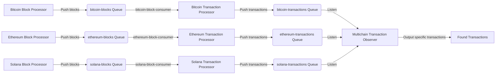

```mermaid
graph LR
    %% Block Processors
    A[Bitcoin Block Processor] -->|Push blocks| B(bitcoin-blocks Queue)
    E[Ethereum Block Processor] -->|Push blocks| F(ethereum-blocks Queue)
    I[Solana Block Processor] -->|Push blocks| J(solana-blocks Queue)

    %% Consumer Groups
    B -->|bitcoin-block-consumer| C[Bitcoin Transaction Processor]
    F -->|ethereum-block-consumer| G[Ethereum Transaction Processor]
    J -->|solana-block-consumer| K[Solana Transaction Processor]

    %% Transaction Queues
    C -->|Push transactions| D(bitcoin-transactions Queue)
    G -->|Push transactions| H(ethereum-transactions Queue)
    K -->|Push transactions| L(solana-transactions Queue)

    %% Multichain Observer below all
    D -->|Listen| M[Multichain Transaction Observer]
    H -->|Listen| M
    L -->|Listen| M

    %% Output of the Multichain Observer
    M -->|Output specific transactions| O[Found Transactions]
```